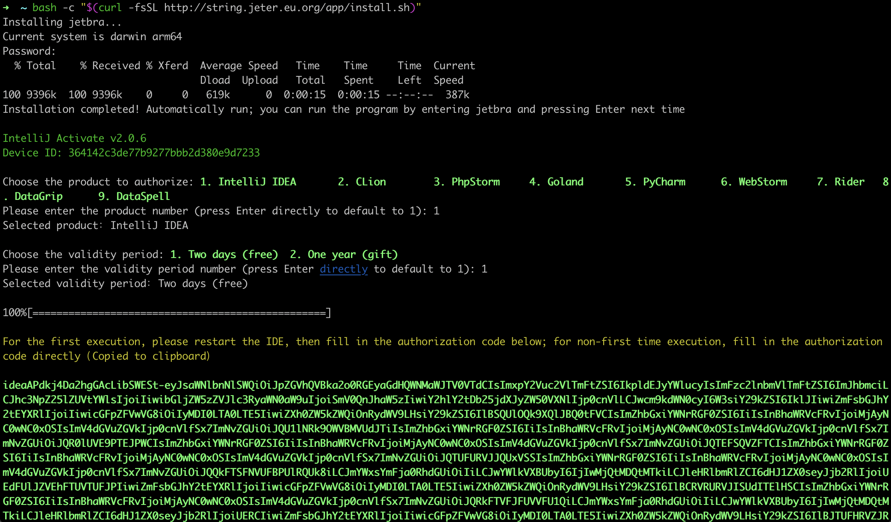

## Jetbra Activate Native

> 🌐️ English 

Jetbra Active Native is a JetBrains IDE activation tool that helps you quickly activate JetBrains IDE.

---
### Important

The original repository is based on a commercial operation, utilizing a private server to activate keys. 
This fork generates activation codes entirely locally through offline signature generation, enabling completely offline usage.

---
### Usage

Open the terminal on MacOS/Linux; Open Git Bash on Windows. Then execute the following command to install:

```shell
go run github.com/youtzz/jetbra-activate-native@latest;
```

---
### Features

> This activation method is compatible with all JetBrains software, such as IntelliJ IDEA, AppCode, CLion, DataGrip, GoLand, PhpStorm, PyCharm, Rider, RubyMine, and WebStorm. It also supports Windows, Mac, and Linux platforms. This activation method supports account login, online updates, cross-platform functionality, and the latest version (genuine activation)

---


---
